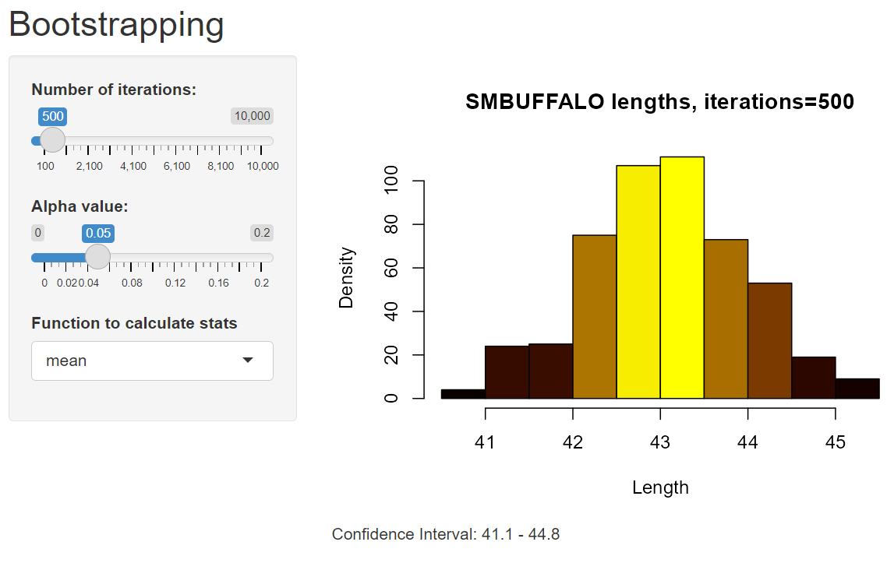

```{r, include = FALSE}
knitr::opts_chunk$set(
  collapse = TRUE,
  comment = "#>",
  fig.width = 6,
  fig.asp = 0.7
)
```

```{r setup}
library(Math4753Lab11PatriceBettag)
```

## Task 1

```{r}
logbin <- function(x,param) log(dbinom(x,prob = param,size = 20))

mymaxlik <- function(lfun,x,param,...){
  # how manyparam values are there?
  np <- length(param)
  # outer -- notice the order, x then param
  # this produces a matrix -- try outer(1:4,5:10,function(x,y) paste(x,y,sep=" "))   to understand
  z <- outer(x,param,lfun)
  # z is a matrix where each x,param is replaced with the function evaluated at those values

  y <- apply(z,2,sum)

  # y is a vector made up of the column sums
  # Each y is the log lik for a new parameter value

  plot(param,
       y,
       col="Blue",
       type="l",
       lwd=2,
       ...)

  # which gives the index for the value of y == max.
  # there could be a max between two values of the parameter, therefore 2 indices
  # the first max will take the larger index
  i <- max(which.max(y))

  abline(v=param[i],
         lwd=2,
         col="Red")

  # plots a nice point where the max lik is
  points(param[i],
         y[i],
         pch=19,
         cex=1.5,
         col="Black")

  axis(3,
       param[i],
       round(param[i],2))

  #check slopes. If it is a max the slope shoud change sign from + to
  # We should get three + and two -vs
  ifelse(i-3 >= 1 & i+2 <= np,
         slope <-  (y[(i-2):(i+2)]-y[(i-3):(i+1)])/(param[(i-2):(i+2)]-param[(i-3):(i+1)]),
         slope <- "NA")

  return(invisible(list(i = i,
                        parami = param[i],
                        yi = y[i],
                        slope = slope)
  ))
}


v <- mymaxlik(x=c(9, 10, 11),
              param=seq(0,1,length=1000),
              lfun=logbin,xlab=expression(p),
              main="Binomial MLE for p",
              cex.main=2)
```

### a

For three independent binomial experiments with n=20 trials and observed successes x={9, 10, 11}, the likelihood function is:
$$
L(p)=\prod_{i=1}^3 \left( \begin{array}{c} 20 \\ x_i \end{array} \right) p^{x_i}(1-p)^{20-x_i}
$$
where $x_1=9$, $x_2=10$, and $x_3=11$. The log-likelihood simplifies to (ignoring constants):
$$
l(p) = \sum_{i=1}^3\left[ x_i \mathsf{ln}(p)+(20-x_i) \mathsf{ln}(1-p) \right] 
$$
Differentiating the Log-likelhood:
$$
l'(p)=\sum_{i=1}^3 \left[ \frac{x_i}{p}-\frac{20-x_i}{1-p} \right] \\
l'(p)=\sum_{i=1}^3 \frac{x_i}{p} - \sum_{i=1}^3 \frac{20-x_i}{1-p}
$$
To maximize the log-likelihood, set the derivative equal to zero and rearrange.
$$
\sum_{i=1}^3 \frac{x_i}{p} = \sum_{i=1}^3 \frac{20-x_i}{1-p} \\
\frac{\sum_{i=1}^3x_i}{p} = \frac{60-\sum_{i=1}^3x_i}{1-p}
$$
where 60 is the total number of trials across all experiments.
$$
(1-p)\sum_{i=1}^3x_i=p(60-\sum_{i=1}^3x_i)
$$
Expand and rearrange:
$$
\sum_{i=1}^3x_i-p\sum_{i=1}^3x_i=p(60)-p\sum_{i=1}^3x_i) \\
p(60)=\sum_{i=1}^3x_i \\
p=\frac{\sum_{i=1}^3x_i}{60}
$$
Given $x_1=9$, $x_2=10$, and $x_3=11$:
$$
p=\frac{9+10+11}{60}=0.5
$$
The MLE for $p$ is: $\hat{p}=0.5$

### b

```{r}
v
```
The function mymaxlik() returns a list containing:
i: this is the index of the parameter value in the grid that maximizes the log-likelihood function.  In this case i is 500 out of 1000, which is the midpoint of the grid, which is consistent with a MLE of 0.5
parami: This is the MLE using the grid function. The function produced a MLE of 0.4994995 which is very close to the theoretical value of $\hat{p}=0.5$.
yi: This is the maximium log-likelihood vale at $\hat{p}$.
slope: These are slopes of the log-likelihood function at points around $\hat{p}$. These slopes switch from positive to zero to negative confirming that a maximum does exist.

### c

The plot generated by mymaxlik() shows a log-likelihood curve peaking at $\hat{p}=0.4994995$, confirming the MLE, and a vertical red line at $\hat{p}$ marking the estimate.

## Task 2

```{r}
logexp <- function(x,param) log(dexp(x,rate = param))

mymaxlik <- function(lfun,x,param,...){
  # how manyparam values are there?
  np <- length(param)
  # outer -- notice the order, x then param
  # this produces a matrix -- try outer(1:4,5:10,function(x,y) paste(x,y,sep=" "))   to understand
  z <- outer(x,param,lfun)
  # z is a matrix where each x,param is replaced with the function evaluated at those values
  
  y <- apply(z,2,sum)
  
  # y is a vector made up of the column sums
  # Each y is the log lik for a new parameter value
  
  plot(param,
       y,
       col="Blue",
       type="l",
       lwd=2,
       ...)
  
  # which gives the index for the value of y == max.
  # there could be a max between two values of the parameter, therefore 2 indices
  # the first max will take the larger index
  i <- max(which.max(y))
  
  abline(v=param[i],
         lwd=2,
         col="Red")
  
  # plots a nice point where the max lik is
  points(param[i],
         y[i],
         pch=19,
         cex=1.5,
         col="Black")
  
  axis(3,
       param[i],
       round(param[i],2))
  
  #check slopes. If it is a max the slope shoud change sign from + to 
  # We should get three + and two -vs
  ifelse(i-3 >= 1 & i+2 <= np, 
         slope <-  (y[(i-2):(i+2)]-y[(i-3):(i+1)])/(param[(i-2):(i+2)]-param[(i-3):(i+1)]),
         slope <- "NA")
  
  return(invisible(list(i = i,
                        parami = param[i],
                        yi = y[i],
                        slope = slope)
  ))
}

#source(file = "lab10.R")


v <- mymaxlik(x=c(5, 5, 6, 7),
              param=seq(0,1,length=1000),
              lfun=logexp,xlab=expression(lambda),
              main="Exponential MLE for Lambda",
              cex.main=2)
```

### a
$Y_i \sim Exp(\lambda)$ with a probability density function(PDF) of:
$$
f(y)=\lambda e^{-\lambda y}, y \ge0
$$

### b
```{r}
v
```

### c

i: This is the index of the parameter value in the grid that maximizes the log-likelihood function. Since the grid consists of 1000 values between 0 and 1, index i=175 corresponds to $\hat{\lambda}$ = 0.1741742.
parami: This is the MLE for $\hat{\lambda}$ which is 0.1741742.
yi: This is the maximum log-likelihood value of -10.9968 at $\hat{\lambda}$ = 0.1741742
slope: These are the slopes of the log-likelihood function at points around $\hat{\lambda}$ changing from positive to negative which confirm that there is a maximum.

## Task 3

```{r}
logexp <- function(x,param) log(dexp(x,rate = param))

mymld<-function(lfun,x,param,delta=0.0001,...){    # param = parameter values, delta=accuracy, x=data
  z=outer(x,param,lfun)    # create outer product and evaluate at lfun
  y=apply(z,2,sum) # x by param, 2=columns , sum columns = sum of log lik
  
  i=max(which(y==max(y)))# the index for which y is biggest, if two then take the last one
  
  param2=seq(param[i-2],param[i+2],by=delta)# The maximum will be between these two, increments by delta
  zz=outer(x,param2,lfun) # new z, call it zz
  yy=apply(zz,2,sum)   # new y, call it yy
  ii=max(which(yy==max(yy)))# new i,  call it ii , if two, take max of them (last one)
  layout(matrix(c(1,2),nrow = 1,ncol = 2,byrow = TRUE))# divide plotting space for two graphs
  plot(param,y,col = "Blue",type = "l",lwd = 2,ylab = "Log. Lik.",xlab = expression(theta))# plot log lik Vs parameter values
  abline(v=param[i],lwd=2,col="Red") # Show vertical line at estimated value          
  axis(3,param[i],round(param[i],2))
  points(param[i],y[i],pch=19,cex=1.5,col="Black")# Plot the point
  plot(param2,yy,col="Blue",type="l",lwd=2,ylab="Log. Lik.",xlab=expression(theta),las=2) # construct new plot for refined estimate
  abline(v=param2[ii],lwd=2,col="Red")  # new verical line
  val=round(param2[ii],abs(log10(delta))) ## rounds to the nth place where n is st delta=10^-n.         
  axis(3,param2[ii],val)
  points(param2[ii],yy[ii],pch=19,cex=1.5,col="Black")
  v <- param2[ii]
  v
}

refined_lambda <- mymld(
  lfun = logexp,
  x = c(5, 5, 6, 7),
  param=seq(0,1,length=1000),
  main="Refined Exponential MLE for Lambda",
  cex.main=2)
v
refined_lambda
```

## Task 4

### a

```{r}
logbin3 <- function(theta){
  log(dbinom(4, prob = theta, size = 10)) +  # X1 = 4/10
  log(dbinom(12, prob = theta, size = 20)) + # X2 = 12/20
  log(dbinom(7, prob = theta, size = 15))    # X3 = 7/15
}

mymaxlikg <- function(lfun="logbin3", theta) { # default log lik is a combination bin
  nth <- length(theta)  # nu. of values used in theta
  thmat <- matrix(theta, nrow=nth, ncol=1, byrow=TRUE) # Matrix of theta
  z <- apply(thmat, 1, lfun) # z holds the log lik values
  zmax <- max(which(z==max(z)))  # finding the INDEX of the max lik
  plot(theta, exp(z), type="l",
       xlab = "Probability (p)",
       ylab = "Likelihood",
       main = "") # plot of lik
  title(main = "MLE for Three Binomial Experiments", adj = 0)
  abline(v = theta[zmax], col="blue")   #  vertical line through max
  axis(3, theta[zmax], round(theta[zmax], 4))  # one tick on the third axis 
  theta[zmax]   # theta corresponding to max lik
}

mymaxlikg(theta=seq(0,1,length=10000))
```

### b

The calculated MLE is $\hat{p}=0.5111511$ which matches the theoretical calculation of total successes divided by total trials ($\frac{23}{45}=0.5\bar{1}$).

## Task 5

### a

```{r}
x <- c(5, 7, 7, 8, 10)  # Sample data
mu <- seq(4, 12, length.out = 100)  # Grid of μ values
sig <- seq(0.1, 5, length.out = 100)  # Grid of σ values

mymlnorm <- function(x,mu,sig,...){  #x sample vector
  nmu=length(mu) # number of values in mu
  nsig=length(sig)
  n=length(x) # sample size
  zz=c()    ## initialize a new vector
  lfun=function(x,m,p) log(dnorm(x,mean=m,sd=p))   # log lik for normal
  for(j in 1:nsig){
    z=outer(x,mu,lfun,p=sig[j]) # z a matrix 
    # col 1 of z contains lfun evaluated at each x with first value of mu, 
    # col2 each x with 2nd value of m 
    # all with sig=sig[j]
    y=apply(z,2,sum)
    # y is a vector filled with log lik values, 
    # each with a difft mu and all with the same sig[j]
    zz=cbind(zz,y)
    ## zz is the matrix with each column containing log L values, rows difft mu, cols difft sigmas 
  }
  maxl=max(exp(zz))
  coord=which(exp(zz)==maxl,arr.ind=TRUE)
  maxlsig=apply(zz,1,max)
  contour(mu,sig,exp(zz),las=3,xlab=expression(mu),ylab=expression(sigma),axes=TRUE,
          main=expression(paste("L(",mu,",",sigma,")",sep="")),...)
  mlx=round(mean(x),2)  # theoretical
  mly=round(sqrt((n-1)/n)*sd(x),2)
  #axis(1,at=c(0:20,mlx),labels=sort(c(0:20,mlx)))
  #axis(2,at=c(0:20,mly),labels=TRUE)
  abline(v=mean(x),lwd=2,col="Green")
  abline(h=sqrt((n-1)/n)*sd(x),lwd=2,col="Red")
  
  # Now find the estimates from the co-ords
  muest=mu[coord[1]]
  sigest=sig[coord[2]]
  
  abline(v=muest, h=sigest)
  return(list(x=x,muest = muest, sigest = sigest,maxl=maxl))
}

mymlnorm(x, mu, sig)
```

### b

The function returns a list containing:
x: The input sample which was 5, 7, 7, 8, 10.
muest: The MLE of 7.393939 for $\mu$ that maximizes the likelihood given the sample data.
sigest: The MLE of 1.634343 for $\sigma$ which maximizes the likelihood given the sample data.
maxl: The maximum likelihood value of 7.323443e-05 which is the highest value of $L(\mu, \sigma)$, indicating how well the parameters fit the data.

The contour plot displays $L(\mu, \sigma)$, with intersecting lines marking the MLE estimates for $\mu$ and $\sigma$. The closer a point is to the maximum likelihood region, the better those parameter values describe the data.

## Task 6

### a

Below the mynewt() function has been adjusted to find the roots of the function: $g(x)=x^2-5x+6$.
The first run of the function finds the root: $r_1=3$. The second run of the function finds the root: $r_2=3$. The xlim of the function has to be adjusted to find the left root.

```{r}
mynewt=function(x0,delta=0.001,f,fdash, xlim = c(-x0,x0)){
  d <- 100
  i <- 0
  x <- c()
  y <- c()
  x[1] <- x0
  y[1] <- f(x[1])
  while(d > delta & i < 1000){
    i <- i+1
    x[i+1] <- x[i] - f(x[i])/fdash(x[i])
    y[i+1] <- f(x[i+1])
    d <- abs(y[i])
  }
  #windows()
  curve(f(x),
        xlim = xlim,
        xaxt = "n", 
        main = "Newton-Raphson Algorithm")
  
  points(x,
         y,
         col = "Red",
         pch = 19,
         cex = 1.5)
  
  axis(1,x,round(x,2),las=2)
  abline(h = 0,col = "Red")
  
  segments(x[1:(i-1)],y[1:(i-1)],x[2:i],rep(0,i-1),col="Blue",lwd=2)
  segments(x[2:i],rep(0,i-1),x[2:i],y[2:i],lwd=0.5,col="Pink")
  
  list(x = x,y = y)
}

mynewt(x0 = 10,
       delta = 0.000001,
       f = function(x) x^2 - 5*x + 6,
       fdash = function(x) 2*x - 5 )
```

```{r}
mynewt=function(x0,delta=0.001,f,fdash, xlim = c(-x0,x0)){
  d <- 100
  i <- 0
  x <- c()
  y <- c()
  x[1] <- x0
  y[1] <- f(x[1])
  while(d > delta & i < 1000){
    i <- i+1
    x[i+1] <- x[i] - f(x[i])/fdash(x[i])
    y[i+1] <- f(x[i+1])
    d <- abs(y[i])
  }
  #windows()
  curve(f(x),
        xlim = xlim,
        xaxt = "n", 
        main = "Newton-Raphson Algorithm")
  
  points(x,
         y,
         col = "Red",
         pch = 19,
         cex = 1.5)
  
  axis(1,x,round(x,2),las=2)
  abline(h = 0,col = "Red")
  
  segments(x[1:(i-1)],y[1:(i-1)],x[2:i],rep(0,i-1),col="Blue",lwd=2)
  segments(x[2:i],rep(0,i-1),x[2:i],y[2:i],lwd=0.5,col="Pink")
  
  list(x = x,y = y)
}

mynewt(x0 = 0,
       delta = 0.000001,
       f = function(x) x^2 - 5*x + 6,
       fdash = function(x) 2*x - 5 ,
       xlim = c(-2,5))
```

### b

Here is a re-written version of mynewt() which creates the derivative of a provided function using first principles so that fdash is not needed.
$$
f'(x)\approx \frac{f(x+h/2)-f(x-h/2)}{h}
$$

```{r}
mynewt<-function(x0, delta=0.001, f, h=0.001, xlim = c(-x0,x0)) {
  d <- 100
  i <- 0
  x <- c()
  y <- c()
  x[1] <- x0
  y[1] <- f(x[1])
  while(d > delta & i < 1000){
    i <- i+1
    deriv <- (f(x[i] + h/2) - f(x[i] - h/2)) / h
    x[i+1] <- x[i] - f(x[i])/deriv
    y[i+1] <- f(x[i+1])
    d <- abs(y[i])
  }
  #windows()
  curve(f(x),
        xlim = xlim,
        xaxt = "n", 
        main = "Newton-Raphson Algorithm")
  
  points(x,
         y,
         col = "Red",
         pch = 19,
         cex = 1.5)
  
  axis(1,x,round(x,2),las=2)
  abline(h = 0,col = "Red")
  
  segments(x[1:(i-1)],y[1:(i-1)],x[2:i],rep(0,i-1),col="Blue",lwd=2)
  segments(x[2:i],rep(0,i-1),x[2:i],y[2:i],lwd=0.5,col="Pink")
  
  list(x = x,y = y)
}

mynewt(x0 = 10,
       delta = 0.000001,
       f = function(x) x^2 - 5*x + 6)
```


```{r}
mynewt<-function(x0, delta=0.001, f, h=0.001, xlim = c(-x0,x0)) {
  d <- 100
  i <- 0
  x <- c()
  y <- c()
  x[1] <- x0
  y[1] <- f(x[1])
  while(d > delta & i < 1000){
    i <- i+1
    deriv <- (f(x[i] + h/2) - f(x[i] - h/2)) / h
    x[i+1] <- x[i] - f(x[i])/deriv
    y[i+1] <- f(x[i+1])
    d <- abs(y[i])
  }
  #windows()
  curve(f(x),
        xlim = xlim,
        xaxt = "n", 
        main = "Newton-Raphson Algorithm")
  
  points(x,
         y,
         col = "Red",
         pch = 19,
         cex = 1.5)
  
  axis(1,x,round(x,2),las=2)
  abline(h = 0,col = "Red")
  
  segments(x[1:(i-1)],y[1:(i-1)],x[2:i],rep(0,i-1),col="Blue",lwd=2)
  segments(x[2:i],rep(0,i-1),x[2:i],y[2:i],lwd=0.5,col="Pink")
  
  list(x = x,y = y)
}

mynewt(x0 = 0,
       delta = 0.000001,
       f = function(x) x^2 - 5*x + 6,
       xlim = c(-2,5))
```

### c

Here is an example of using myNRML() to create the MLE for $\lambda$ when two Poisson experiments are made with the same disintegrating nuclear substance: $\lambda=3.5$

```{r}
myNRML <- function(x0,delta = 0.001,llik,xrange,parameter = "param"){
  f <- function(x) (llik(x+delta)-llik(x))/delta
  fdash <- function(x) (f(x+delta)-f(x))/delta
  d=1000
  i=0
  x=c()
  y=c()
  x[1]=x0
  y[1]=f(x[1])
  while(d > delta & i<100){
    i=i+1
    x[i+1]=x[i]-f(x[i])/fdash(x[i])
    y[i+1]=f(x[i+1])
    d=abs(y[i+1])
  }
  layout(matrix(1:2,nrow=1,ncol=2,byrow=TRUE),widths=c(1,2))
  curve(llik(x), xlim=xrange,xlab=parameter,ylab="log Lik",main="Log Lik")
  curve(f(x),xlim=xrange,xaxt="n", xlab=parameter,ylab="derivative",main=  "Newton-Raphson Algorithm \n on the derivative")
  points(x,y,col="Red",pch=19,cex=1.5)
  axis(1,x,round(x,2),las=2)
  abline(h=0,col="Red")
  
  segments(x[1:(i-1)],y[1:(i-1)],x[2:i],rep(0,i-1),col="Blue",lwd=2)
  segments(x[2:i],rep(0,i-1),x[2:i],y[2:i],lwd=0.5,col="Green")
  
  list(x=x,y=y)
}

myNRML(x0=2,delta=0.000001,llik=function(x)
  log(dpois(3,lambda=x)*dpois(4, lambda=x)),xrange=c(0.01,10),
  parameter="lambda" )
```

## Task 7

### a

Here is an example of using myboot() to find the mean LMBASS fish WEIGHTS using the DDT data set.  We can see that the mean is 629.

```{r}
myboot <- function(iter = 10000,x,fun = "mean",alpha = 0.05,cx = 1.5,...){  #Notice where the ... is repeated in the code
  n <- length(x)   #sample size
  
  y <- sample(x, n * iter,replace = TRUE)
  rs.mat <- matrix(y,nrow = n,ncol = iter,byrow = TRUE)
  xstat <- apply(rs.mat,2,fun) # xstat is a vector and will have iter values in it 
  ci <- quantile(xstat,c(alpha/2,1-alpha/2))# Nice way to form a confidence interval
  # A histogram follows
  # The object para will contain the parameters used to make the histogram
  para <- hist(xstat,
               freq = FALSE,
               las = 1,
               main = paste("Histogram of Bootstrap sample statistics",
                            "\n","alpha=",alpha," iter=",iter,sep=""),
               ...)
  
  #mat will be a matrix that contains the data, this is done so that I can use apply()
  mat <- matrix(x,nrow=length(x),ncol=1,byrow=TRUE)
  
  #pte is the point estimate
  #This uses whatever fun is
  pte <- apply(mat,2,fun)
  abline(v=pte,lwd=3,col="Black")# Vertical line
  segments(ci[1],0,ci[2],0,lwd=4)      #Make the segment for the ci
  text(ci[1],0,paste("(",round(ci[1],2),sep=""),col="Red",cex=cx)
  text(ci[2],0,paste(round(ci[2],2),")",sep=""),col="Red",cex=cx)
  
  # plot the point estimate 1/2 way up the density
  text(pte,max(para$density)/2,round(pte,2),cex=cx)
  
  invisible(list(ci = ci,fun = fun,x = x))# Some output to use if necessary
}

data(ddt, package = "Math4753Lab11PatriceBettag")
library(dplyr)
lmbass_weights <- ddt %>%
  filter(SPECIES == "LMBASS") %>%
  pull(WEIGHT)

myboot(iter = 10000, x = lmbass_weights, fun = "mean", alpha = 0.05, xlab = "mean of LMBASS Weights", col = "purple", cx = 1.5)
```

### b

Performing a t-test on the LMBASS fish WEIGHTS results in a 95% confidence interval of (422.6596, 835.3404) meaning we are 95% confident that the true mean weight of LMBASS lies within the interval.

```{r}
t.test(lmbass_weights, conf.level = 0.95)
```

## Task 8

Here is the link to the updated Shiny App and a screen shot as well:

[myboot Shiny App](https://g91nmu-patrice-bettag.shinyapps.io/myboot/)




